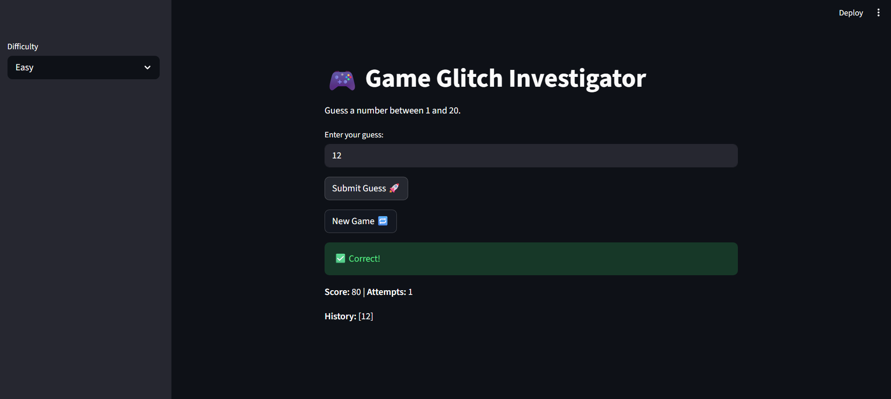
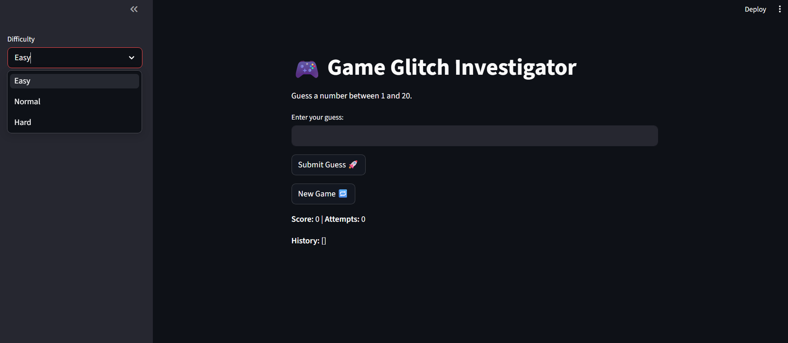

# 🎮 Game Glitch Investigator: The Impossible Guesser

## 🚨 The Situation

You asked an AI to build a simple "Number Guessing Game" using Streamlit.
It wrote the code, ran away, and now the game is unplayable. 

- You can't win.
- The hints lie to you.
- The secret number seems to have commitment issues.

## 🛠️ Setup

1. Install dependencies: `pip install -r requirements.txt`
2. Run the broken app: `python -m streamlit run app.py`

## 🕵️‍♂️ Your Mission

1. **Play the game.** Open the "Developer Debug Info" tab in the app to see the secret number. Try to win.
2. **Find the State Bug.** Why does the secret number change every time you click "Submit"? Ask ChatGPT: *"How do I keep a variable from resetting in Streamlit when I click a button?"*
3. **Fix the Logic.** The hints ("Higher/Lower") are wrong. Fix them.
4. **Refactor & Test.** - Move the logic into `logic_utils.py`.
   - Run `pytest` in your terminal.
   - Keep fixing until all tests pass!

## 📝 Document Your Experience

### Game Purpose
The **Glitchy Guesser** is a Streamlit-based number guessing game designed to challenge players across three difficulty levels (Easy, Normal, and Hard). It tracks player progress through a scoring system and a guess history log.

### Bugs Identified & Fixed
- **Reversed Comparison Logic:** The game originally gave "Go HIGHER" hints for high guesses and "Go LOWER" for low guesses. I corrected this in `logic_utils.py` so hints now correctly guide the player.
- **State Persistence Issues:** The score and history were not resetting when a new game was started. I added state-clearing logic to the `new_game` button in `app.py`.
- **Input Validation:** Invalid inputs (like strings or decimals) were previously counted as attempts. I integrated `parse_guess` to ensure only valid integers decrement the attempt counter.
- **Scoring Glitches:** The scoring logic was inconsistent. I updated `update_score` to provide a consistent penalty for wrong guesses and a reward for winning.

### 📸 Demo
All core logic has been verified using a comprehensive test suite.
- **Pytest Results:** 32/32 tests passed successfully.
- **Core Files:** Logic is fully decoupled into `logic_utils.py`, making the app modular and maintainable.

## 🚀 Stretch Features

